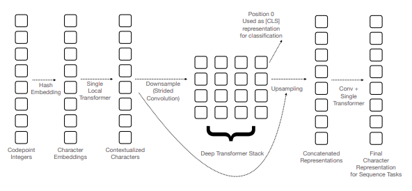

# What is SHIBA?

SHIBA is an approximate reimplementation of CANINE[[1]](#1) in raw Pytorch, pretrained on the Japanese wikipedia corpus using random span masking. If you are unfamiliar with CANINE, you can think of it as a very efficient (approximately 4x as efficient) character-level BERT model. Of course, the name SHIBA comes from the identically named Japanese canine. 

日本語版のREADMEは[ここ](README.ja.md)から閲覧できます。
また、質問がある方は日本語でもお気軽にどうぞ。issueを英語で書く必要はありません。



The biggest advantages SHIBA provides are in terms of utility, because (like CANINE) it:
1. Runs on raw characters, and so has no vocabulary limitations. You can fine tune it on words or languages it's never seen before.
2. Efficiently handles a lot of characters. Compared to caracter-level BERT models, you can get 4x as many character embeddings in one pass (2048) for a comparable amount of compute.

That said, we compared SHIBA against baselines on two downstream tasks, and it also performs pretty well.

# Performance 
The first task was classification on the [Livedoor News Corpus](https://www.rondhuit.com/download.html), using as much of the article as we text as we could fit into the model in one pass. 

| Model | Accuracy  |
|---|---|
| SHIBA | 95.5% |
| [bert-base-japanese](https://huggingface.co/cl-tohoku/bert-base-japanese) | 95.1% |
| [bert-base-japanese-char](https://huggingface.co/cl-tohoku/bert-base-japanese-char) |  92.9% |

The second task was word segmentation on the [UD Japanese GSD corpus](https://universaldependencies.org/treebanks/ja_gsd/index.html).

| Model | F1  |
|---|---|
| MeCab | 99.7%  |
| SHIBA | 98.0% |

It turns out it's pretty difficult to beat MeCab on UD word segmentation, but we expect SHIBA to be useful for segmenting messy text where tools like MeCab which use dictionaries struggle.


## How do I use it?

If you just want to use the SHIBA model, you can install it like this:
> pip install shiba-model


For an example of how to load and use the pretrained model, see below. `get_pretrained_state_dict()` will automatically download the pretrained model for you, but if you'd like to do it yourself the model can be downloaded from [here](https://storage.googleapis.com/shiba.octanove.com/published_checkpoints/shiba_check45k.pt).

```python
from shiba import Shiba, CodepointTokenizer, get_pretrained_state_dict
shiba_model = Shiba()
shiba_model.load_state_dict(get_pretrained_state_dict())
tokenizer = CodepointTokenizer()

inputs = tokenizer.encode_batch(['自然言語処理', '柴ドリル'])
outputs = shiba_model(**inputs)
```

SHIBA can then be fine-tuned for classification or character-level tasks just like any other transformer encoder. Adding task-specific layers should be relatively easy, but premade models for classification and sequence labeling are also included. These are `ShibaForClassification` and `ShibaForSequenceLabeling`, respectively. 

```python
from shiba import ShibaForClassification
cls_model = ShibaForClassification(vocab_size=3)
cls_model.load_encoder_checkpoint()
```

`load_encoder_checkpoint()` loads just the pretrained encoder checkpoint, but running `cls_model.shiba_model.load_state_dict(get_pretrained_state_dict())` will give you the same result. 

If your task is simple and you just need an efficient character-level model, you can also just train a SHIBA model from scratch.

# Details

A techinical blog post about SHIBA will be available shortly, but below are some of the important details. 

## Differences from CANINE

The architecture of the SHIBA model is very similar to that of CANINE. However, there are a few differences of note.

* SHIBA uses [windowed local attention](https://github.com/lucidrains/local-attention), not the blockwise local attention used by CANINE. 
* SHIBA does not have token type embeddings. 
* There are very minor differences in how the downsampling of charater embeddings is done. The most important is that SHIBA will not truncate the last character of max-length sequences like CANINE will.

## Model Code

The model code can be found [here](shiba/model.py), and the tokenizer code can be found [here](shiba/codepoint_tokenizer.py). The model code was written to be relatively easy to understand and to change, so if you are curious about how the model works, the fastest way be reading and changing the code yourself. 


## Training Methodology

We trained on the Japanese Wikipedia corpus, using mostly identical preprocessing to the Tohoku University [Japanese Bert](https://github.com/cl-tohoku/bert-japanese) model. Training example creation was done similarly to RoBERTa[[2]](#2), packing as many sentences as could fit into each training example. Our masking strategy was _random span masking_, whereby we perform dynamic random masking on contiguous spans of characters. Where `[M]` is a unicode codepoint representing a mask character, an example masking transformation might look like the below.

> 柴犬は最強の犬種である
> 
> 柴犬は[M][M]の犬種である

Random replacements are selected from a pretrained BPE vocabulary, such that the replacement for a span of length two would be a two-character BPE token.

If you would like to reproduce our training, please see [TRAINING.md](TRAINING.md).

Our hyperparameters (including the masking type) were chosen based their performance on much smaller subsets of the data, and on the hyperparameters used in training similar transformer encoders: specifically those of RoBERTa[[2]](#2) and Academic Budget BERT[[3]](#3).

## Training Code

This repository also includes the code used for actually training the SHIBA model (which is not in the `shiba-model` package). This code has significantly more dependencies than just the model and is not as polished, but if you are considering training a SHIBA/CANINE model it may be of interest to you. In particular, there are implementations of BPE masking and random span masking in the [masking.py](training/masking.py) file. 

## Checkpoints

The default model is the encoder model that performs best on downstream tasks, but we provide a few other checkpoints. 

| Type              | Step | Note            |
|-------------------|------|-----------------|
| [Encoder Only](https://storage.googleapis.com/shiba.octanove.com/published_checkpoints/shiba_check45k.pt)      | 45k  | (default model) |
| [Encoder Only](https://storage.googleapis.com/shiba.octanove.com/published_checkpoints/shiba_check60k.pt)     | 60k  |                 |
| [LM Head + Encoder](https://storage.googleapis.com/shiba.octanove.com/published_checkpoints/lm_check45k.pt) | 45k  |                 |
| [LM Head + Encoder](https://storage.googleapis.com/shiba.octanove.com/published_checkpoints/lm_check60k.pt) | 60k  |                 |

# Licensing

The code and contents of this repository are provided under the Apache License 2.0. The pretrained model weights are provided under the CC BY-SA 4.0 license. 

# How to cite this work

There is no paper associated with SHIBA, but the repository can be cited like this:

```bibtex
@misc{shiba,
  author = {Joshua Tanner and Masato Hagiwara},
  title = {SHIBA: Japanese CANINE model},
  year = {2021},
  publisher = {GitHub},
  journal = {GitHub repository},
  howpublished = {\url{https://github.com/octanove/shiba}},
}
```

Please also cite the original CANINE paper:
```bibtex
@misc{clark2021canine,
      title={CANINE: Pre-training an Efficient Tokenization-Free Encoder for Language Representation}, 
      author={Jonathan H. Clark and Dan Garrette and Iulia Turc and John Wieting},
      year={2021},
      eprint={2103.06874},
      archivePrefix={arXiv},
      primaryClass={cs.CL}
}
```

# References
<a id="1">[1]</a> Jonathan H. Clark and Dan Garrette and Iulia Turc and John Wieting (2021). [CANINE: Pre-training an Efficient Tokenization-Free Encoder for Language Representation](https://arxiv.org/abs/2103.06874). CoRR, abs/2103.06874.

<a id="2">[2]</a> Yinhan Liu and Myle Ott and Naman Goyal and Jingfei Du and Mandar Joshi and Danqi Chen and Omer Levy and Mike Lewis and Luke Zettlemoyer and Veselin Stoyanov (2019). [RoBERTa: A Robustly Optimized BERT Pretraining Approach](https://arxiv.org/abs/1907.11692). CoRR, abs/1907.11692.

<a id="3">[3]</a>
Peter Izsak and Moshe Berchansky and Omer Levy (2021). [How to Train BERT with an Academic Budget](https://arxiv.org/abs/2104.07705). CoRR, abs/2104.07705.


